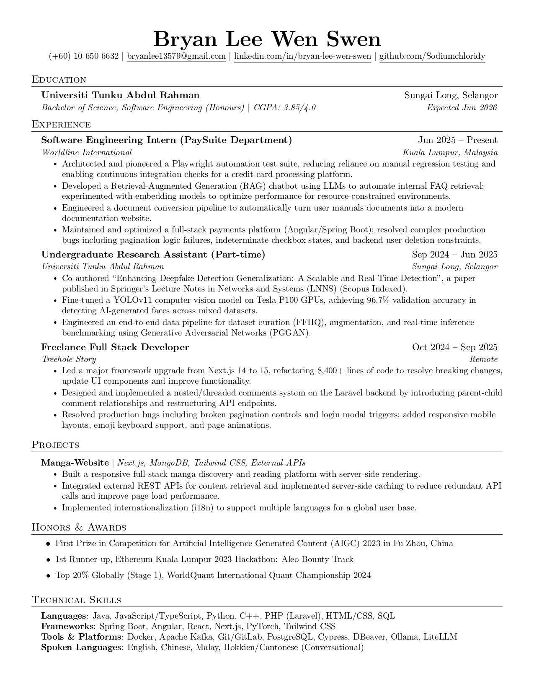

# Bryan Lee Wen Swen's Resume

This repository contains the LaTeX source code for my personal resume. Adapted from the [jakegut/resume](https://github.com/jakegut/resume) template.

## How to Build

You can compile the PDF locally or use an online LaTeX editor like Overleaf.

### Option 1: Overleaf (Recommended)
1. Go to [Overleaf](https://www.overleaf.com/) and create a new project.
2. Select **Upload Project** and upload the files from this repository (or simply copy the contents of `resume.tex` into a blank project).
3. Overleaf will automatically compile the document and generate a PDF preview.

### Option 2: Local Compilation
To build the PDF locally, you need a standard LaTeX distribution (such as TeX Live, MiKTeX, or MacTeX). Run the following command in your terminal:

```bash
pdflatex resume.tex
```

## Preview


